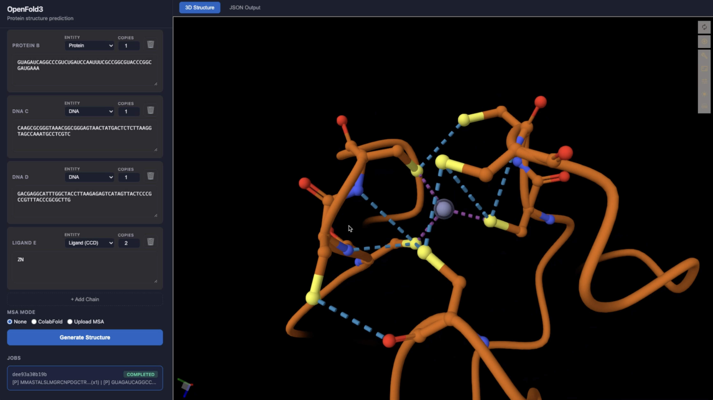

# PFUI — Protein Structure Prediction UI for OpenFold3

A lightweight, self-hosted web UI for running [OpenFold3](https://github.com/aqlaboratory/openfold-3)
protein/nucleic-acid/ligand structure prediction on a single GPU or a SLURM
cluster. Paste sequences in the browser, submit a job, and view the predicted
structure in an embedded [Mol\*](https://molstar.org/) viewer.

Built and tested on AMD MI300 GPUs (ROCm), but the design is hardware-agnostic —
see [Adapting PFUI](#adapting-pfui).



## Features

- Multi-chain input: Protein, RNA, DNA, and ligands (SMILES or CCD codes), with copy counts.
- MSA options: none, on-the-fly [ColabFold](https://github.com/sokrypton/ColabFold) MSA server, or upload your own `.a3m`/`.npz`.
- Interactive 3D viewer (Mol\*) plus raw confidence-JSON output.
- Job list with live status polling.
- Three deployment modes (persistent GPU server, per-job SLURM, or plain Docker Compose).

## Architecture

PFUI has two components:

- **UI** (`app.py`, `templates/index.html`) — a small Flask app. Collects input,
  writes a query JSON, dispatches a prediction, and serves results. Image: `pfui:latest`.
- **Inference** — OpenFold3 itself, running in its own container
  (`configs/OpenFold3/Dockerfile.rocm`). How the UI talks to it depends on the mode:

| Mode | Launch | How inference runs | Best for |
|------|--------|--------------------|----------|
| **GPU server** | `sbatch launch-gpu.slurm` | One persistent inference server (`inference_server.py`) holds the model in GPU memory; jobs are queued and run sequentially. | Fast, repeated predictions on one GPU. |
| **CPU/SLURM** | `sbatch launch-cpu.slurm` | UI runs CPU-only; each prediction spawns its own GPU SLURM job. Cold-loads the model each time but parallelizes across the cluster. | Many independent jobs / large clusters. |
| **Bare metal** | `docker compose up` | Same as GPU server, but without SLURM, on a single GPU node. | Local dev / a single workstation. |

The UI is identical across modes; behavior is selected by the `INFERENCE_MODE`
env var (`server` or `slurm`) that the launch scripts set for you.

## Prerequisites

- Docker (with GPU access configured for your hardware — e.g. ROCm device nodes for AMD).
- For SLURM modes: a SLURM cluster you can `sbatch` to, with GPU nodes.
- For bare-metal mode: a single machine with a supported GPU.

## Quick start

### 1. Configure

Copy the repo onto the host and edit two things:

1. **`config.env`** — set `RESULTS_DIR`, `CACHE_DIR`, ports, and image name for your machine.
2. **SLURM directives** (SLURM modes only) — open `launch-gpu.slurm`,
   `launch-cpu.slurm`, and `configs/OpenFold3/inference_template.slurm` and replace
   every `--partition=CHANGE_ME` (and adjust `--gres` if your cluster names GPUs
   differently). These can't be variables because SLURM reads them before the
   shell runs.

`config.env` variables:

| Variable | Meaning |
|----------|---------|
| `PFUI_DIR` | Repo root. SLURM scripts set this automatically (`$SLURM_SUBMIT_DIR`). |
| `RESULTS_DIR` | Where OpenFold3 writes outputs (`$RESULTS_DIR/pfui_jobs/<job_id>/`). |
| `CACHE_DIR` | Model/weight cache. Use fast, persistent local storage. |
| `OF3_DOCKERFILE` | OpenFold3 Dockerfile (rebuilt every launch). |
| `DOCKER_IMAGE` | Tag for the OpenFold3 image. |
| `PFUI_PORT` | UI port (default `8060`). |
| `INFERENCE_PORT` | GPU-server port (default `8061`, internal only). |

### 2. Launch

Run the launch script from the repo root so `$SLURM_SUBMIT_DIR` resolves correctly:

```sh
# GPU server (recommended)
sbatch launch-gpu.slurm

# or: CPU UI + per-job GPU SLURM jobs
sbatch launch-cpu.slurm
```

The first launch builds the OpenFold3 image and loads the model (~5–10 min).
Watch the job's `.out` log; it prints the exact SSH tunnel command to use.

**Bare metal (no SLURM):**

```sh
set -a; source config.env; set +a    # expand $HOME/$USER and export for compose
docker compose up --build
```

Builds both images, starts the inference server, waits until it's healthy, then
starts the UI on `http://localhost:${PFUI_PORT}`. (Sourcing rather than
`--env-file` matters: compose's env-file does not expand `$HOME`/`$USER`.)

### 3. Access the UI

PFUI binds to the compute node only, so tunnel to it from your laptop:

```sh
ssh -N -L 8060:<compute-node>:8060 <user>@<login-host>
```

Then open <http://localhost:8060>. (For bare-metal on your own machine, just open
the URL directly.)

## Using the UI

1. **Add chains.** Each chain has an entity type (Protein / RNA / DNA / Ligand)
   and a copy count. Paste a sequence, or for ligands enter a SMILES string or
   comma-separated CCD codes. Chain IDs (A, B, C, …) are assigned automatically.
2. **Pick an MSA mode:**
   - *None* — single-sequence prediction (fastest, lower accuracy).
   - *ColabFold* — generates MSAs via the public ColabFold server.
   - *Upload MSA* — attach an `.a3m`/`.npz` per protein/RNA chain.
3. **Generate Structure.** The job appears in the list and updates live
   (queued → running → completed/failed).
4. **View results.** Completed jobs render in the 3D viewer; switch to **JSON
   Output** for per-residue confidence. Use the file selector when a job produced
   multiple models.

Outputs are also written to disk under `${RESULTS_DIR}/pfui_jobs/<job_id>/`.

## Repository layout

```
app.py                                  UI backend (Flask)
inference_server.py                     Persistent GPU inference server (GPU mode)
templates/index.html                    Single-page frontend (Mol* viewer)
Dockerfile.server                       UI image
requirements.txt                        UI Python deps
config.env                              Central configuration
launch-gpu.slurm / launch-cpu.slurm     SLURM entry points
docker-compose.yml                      Bare-metal entry point
configs/OpenFold3/
  Dockerfile.rocm                       OpenFold3 inference image (ROCm)
  inference_template.slurm              Per-job SLURM template (CPU mode)
  inference_config_pfui.yml             OpenFold3 runner settings
CLAUDE.md                               Deep-dive notes & gotchas (for contributors/agents)
```

## Adapting PFUI

PFUI is configured mostly with OpenFold3 default parameters but with some deviations:

- **Model settings (recycles, diffusion steps, kernels):** edit
  `configs/OpenFold3/inference_config_pfui.yml`.
- **Run settings (num_diffusion_samples etc.):** Some relevant runtime settings
  are passed to OpenFold3 outside the YAML as env vars.
  `num_diffusion_samples` (number of candidate structures sampled per seed) for example is set to `1`while OpenFold3 default value is `5`.
- **Ports / paths:** all in `config.env`.

`inference_server.py` is bind-mounted read-only, so editing it takes effect on the
next launch with no image rebuild. `app.py` and `index.html` are baked into
`pfui:latest`, which the launch scripts rebuild on every run.

See `CLAUDE.md` for non-obvious implementation details and troubleshooting.

## License

See the repository root for license information. OpenFold3 and its weights are
governed by their own licenses.
